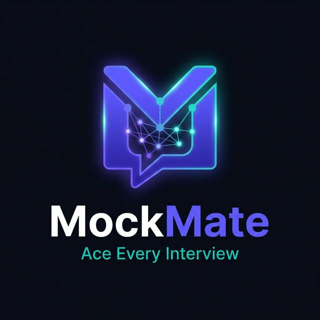

<div align="center">



# MockMate

### AI-Powered Interview Practice Platform

*Ace Every Interview — Powered by Groq AI*

[](https://flutter.dev)
[](https://dart.dev)
[](https://console.groq.com)
[](#architecture)
[](LICENSE)

</div>

---

## ✨ What is MockMate?

MockMate is a sleek, production-grade Flutter application that gives you a real-feeling technical interview experience — with **instant AI feedback** on every answer, powered by Groq's blazing-fast Llama 3 70B model.

Pick your **role**, choose your **difficulty**, practice your answers, and get a detailed score with strengths and areas to improve — all in under a minute per question.

---

## 🎬 Features

| Feature | Description |
|---------|-------------|
| 🤖 **AI Interview** | Groq LLaMA 3 70B generates role-specific questions and evaluates answers with 0–100 scoring |
| 🎭 **Role Selection** | 10+ job roles — Flutter Dev, Backend, ML Engineer, DevOps, Product Manager, and more |
| 📊 **Dashboard** | Session history, average score, weekly progress chart (fl_chart), best score card |
| 🔐 **Auth** | JWT-based login/register with Flutter Secure Storage token management |
| 🎨 **Dark / Light** | Full Material 3 theming with persistent mode preference |
| 🎬 **Splash Screen** | Cinematic "Intelligence Awakening" animated splash with neural-node particles |
| 📱 **Custom Launcher Icon** | Brand icon for all Android densities (mdpi → xxxhdpi) + adaptive icon |

---

## 🏗️ Architecture

MockMate follows **Clean Architecture** principles — the UI never touches the network directly.

```
lib/
├── core/
│   ├── constants/        # API endpoints, app config, job roles
│   ├── di/               # GetIt dependency injection
│   ├── errors/           # Failures & Exceptions hierarchy
│   ├── network/          # Dio client with auth interceptor
│   ├── router/           # GoRouter with auth guard
│   ├── theme/            # Material 3 dark/light AppTheme
│   └── widgets/          # Shared UI components
│
├── features/
│   ├── splash/           # Animated splash screen
│   ├── auth/             # Login · Register · Onboarding
│   │   ├── data/         # UserModel, AuthRemoteDataSource, AuthRepositoryImpl
│   │   ├── domain/       # User entity, AuthRepository interface, UseCases
│   │   └── presentation/ # AuthBloc (5 states), Screens
│   │
│   ├── interview/        # Core product feature
│   │   ├── data/         # GroqDataSource, InterviewModels, RepositoryImpl
│   │   ├── domain/       # Question/Feedback entities, UseCases
│   │   └── presentation/ # InterviewBloc (7 states), 3 Screens
│   │
│   └── dashboard/        # Analytics & History
│       ├── data/         # Models (with mock fallback), RepositoryImpl
│       ├── domain/       # SessionHistory, Analytics entities, UseCases
│       └── presentation/ # DashboardBloc, Dashboard + History Screens
```

### Data Flow

```
Widget → dispatches Event → Bloc → calls UseCase → Repository decides:
                                                    ├── Remote (API/Groq)
                                                    └── either(Failure, Success) → Bloc emits State → Widget rebuilds
```

---

## 🤖 InterviewBloc State Machine

```
InterviewInitial
  └─[StartInterview]──► InterviewLoading
                              └─[questions ready]──► InterviewInProgress
                                                           └─[SubmitCurrentAnswer]──► AnswerSubmitting
                                                                                           └─[AI feedback]──► FeedbackReceived
                                                                                                                    ├─[NextQuestion, not last]──► InterviewInProgress
                                                                                                                    └─[NextQuestion, last]──────► InterviewCompleted ──► FeedbackScreen
```

---

## 🛠️ Tech Stack

| Layer | Technology |
|-------|------------|
| **UI** | Flutter 3, Material 3, Google Fonts (Inter) |
| **State** | flutter_bloc, Equatable |
| **Navigation** | GoRouter (auth guard, deep links) |
| **AI** | Groq API — Llama 3 70B (question gen + answer eval) |
| **Networking** | Dio, Retrofit |
| **Storage** | flutter_secure_storage (tokens), SharedPreferences (theme) |
| **Charts** | fl_chart (weekly progress line chart) |
| **DI** | GetIt |
| **Error Handling** | dartz Either<Failure, T> |
| **Config** | flutter_dotenv |

---

## 🚀 Getting Started

### Prerequisites

- [Flutter SDK](https://docs.flutter.dev/get-started/install) ≥ 3.0.0
- [Groq API Key](https://console.groq.com) — free, takes 30 seconds to get

### 1. Clone the repo

```bash
git clone https://github.com/adeshpatel700-rgb/Mockmate.git
cd Mockmate
```

### 2. Install dependencies

```bash
flutter pub get
```

### 3. Set up environment

```bash
cp .env.example .env
```

Open `.env` and add your Groq API key:

```env
GROQ_API_KEY=gsk_your_key_here
GROQ_BASE_URL=https://api.groq.com/openai/v1
API_BASE_URL=http://localhost:8000/api/v1
```

> 💡 Get a **free** Groq API key at [console.groq.com](https://console.groq.com) — no credit card required.

### 4. Run the app

```bash
flutter run
```

> **Demo mode**: The dashboard uses mock data automatically if no backend is connected. The AI interview feature requires the Groq key.

### 5. Build release APK

```bash
flutter build apk --release
# Output: build/app/outputs/flutter-apk/app-release.apk
```

---

## 🌐 Backend (Optional)

The auth and history features require a FastAPI backend. The app runs in **demo mode** without it — dashboard shows mock analytics and history.

To enable full functionality, deploy the FastAPI backend and update `API_BASE_URL` in your `.env`.

*Backend setup guide coming soon.*

---

## 📁 Key Files

| File | Description |
|------|-------------|
| `lib/main.dart` | App entry — async init, DI, theme, orientation |
| `lib/core/router/app_router.dart` | All routes + auth guard |
| `lib/core/di/injection_container.dart` | GetIt registrations |
| `lib/core/theme/app_theme.dart` | Brand colours, Material 3 theme |
| `lib/features/interview/data/datasources/groq_datasource.dart` | Groq AI integration + prompt templates |
| `lib/features/splash/presentation/splash_screen.dart` | Animated splash (CustomPainter, shimmer, typewriter) |

---

## 📄 License

```
MIT License — Copyright (c) 2026 Adesh Patel
```

Free to use, modify, and distribute. Attribution appreciated.

---

<div align="center">

Built with ❤️ using Flutter & Groq AI

**[⭐ Star this repo](https://github.com/adeshpatel700-rgb/Mockmate)** if you find it useful!

</div>
